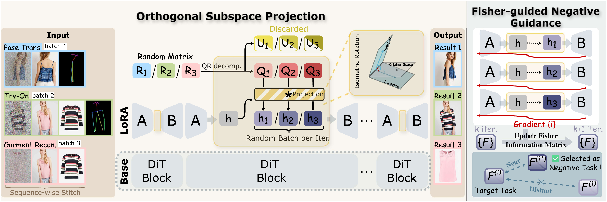

<div align="center">
<h1>OrthoTryOn: Geometric Orthogonalization for Conflict-Free Unified Fashion Generation</h1>

<a href="https://arxiv.org/abs/2606.27880"></a>
<a href="https://github.com/NJU-PCALab/OrthoTryOn"></a>
<a href="https://huggingface.co/Jerome-Young/OrthoTryOn"></a>
<a href="https://huggingface.co/datasets/Jerome-Young/OrthoTryOn-Instructions"></a>

</div>

## Model Introduction

We introduce OrthoTryOn, a unified and parameter-efficient framework for fashion image generation, designed to mitigate inter-task 
interference in shared adaptation and enable high-quality virtual try-on, garment reconstruction, and pose transfer within a single model. 
Its plug-and-play design can further extend to broader multi-task scenarios.

<div align="center">
  
</div>

### Highlights

- 🌟**Conflict-Free Unified Generation**: OrthoTryOn supports virtual try-on, garment reconstruction, and pose transfer within a single shared model, avoiding the deployment cost of multiple task-specific adapters.
- 🌟**Geometric Task Decoupling**: Our Orthogonal Subspace Projection introduces task-specific orthogonal rotations into the shared LoRA bottleneck, reducing destructive gradient interference while preserving effective cross-task knowledge sharing.
- 🌟**Fisher-Guided Inference**: Our parameter-free Fisher-guided Negative Guidance identifies and suppresses the most confusable task during inference, mitigating residual semantic leakage and improving generation fidelity.

## Showcase

<div align="center">
  
</div>

## Quick Start

### Installation

```bash
conda create -n orthotryon python=3.10 -y
conda activate orthotryon

pip install --upgrade pip
pip install -r requirements.txt
```

### Data Preparation

#### Virtual Try-On

Download the VITON-HD dataset from the [official repository](https://github.com/shadow2496/VITON-HD).

To obtain garment-removed reference-person images, we follow the image synthesis protocol of [Any2AnyTryon](https://github.com/logn-2024/Any2anyTryon). These synthesized reference images are stored under `edited_image/`.

We extract human skeleton maps with [MMPose](https://github.com/open-mmlab/mmpose) using the HRNet-W48 COCO top-down model:

```text
Config: td-hm_hrnet-w48_8xb32-210e_coco-256x192
Checkpoint: td-hm_hrnet-w48_8xb32-210e_coco-256x192-0e67c616_20220913.pth
```

We generate garment-specific editing instructions using [Qwen2.5-VL-7B-Instruct](https://github.com/QwenLM/Qwen2.5-VL). During training annotation generation, the first image is the edited image and the second image is the ground-truth target image. We use the following prompt:

> You are an expert fashion editor. You are provided with two images:
> 1. The first image is the **Source Image** (Before). 
> 2. The second image is the **Target Image** (After).
> 
> Analyze the difference in the clothing between the Source and the Target. Provide a single, concise imperative editing instruction to transform the Source into the Target.  
> Examples:  
> - “Change the blue denim jacket to a red silk blouse.” 
> - “Add a black leather belt to the dress.” 
> - “Remove the graphic logo from the t-shirt.” 
> - “Change the white long-sleeved shirt to a red-and-white striped short-sleeved shirt.” 
>
> Focus only on the garment changes. Output ONLY the instruction sentence.

At test time, users may separately generate a detailed description of the target garment. This description can replace the target-garment-related content in the editing instruction and should be saved under `edit_instructs/`. Pre-generated instruction annotations are available from [here](https://huggingface.co/datasets/Jerome-Young/OrthoTryOn-Instructions).

```text
<VITONHD_ROOT>/
├── test_pairs.txt
└── test/
    ├── image/
    ├── edited_image/
    ├── cloth/
    ├── mmpose_skeleton/
    ├── edit_instructs/
    └── paired_edit_instructs/     # Only for paired VTON testing
```

#### Garment Reconstruction (VTOFF)

VTOFF uses the same VITON-HD dataset and directory structure described above.

#### Pose Transfer

Download the DeepFashion dataset from the [official project page](https://liuziwei7.github.io/projects/DeepFashion.html). Follow the same MMPose HRNet-W48 procedure used for VTON to extract target-pose skeleton maps, and save them under `test_skeleton/`.

```text
<DEEPFASHION_ROOT>/
├── fasion-resize-pairs-test.csv
├── test_highres/
└── test_skeleton/
```

### Model Download

Download the [LongCat-Image-Edit base model](https://huggingface.co/meituan-longcat/LongCat-Image-Edit) and the [OrthoTryOn LoRA checkpoint](https://huggingface.co/Jerome-Young/OrthoTryOn) from Hugging Face.

### Run Virtual Try-On
```bash
python scripts/inference_ortho.py \
  --task vton \
  --vton_root_dir /path/to/VITONHD \
  --test_pairs_file test_pairs.txt \
  --setting unpaired/paired \
  --model_path checkpoints/LongCat-Image-Edit \
  --lora_path checkpoints/OrthoTryOn \
  --sampler cfg
```

#### Optional VTON Refinement

For background-preserving refinement, use refine.py together with the agnostic mask to repaint non-garment regions with the original ground-truth image.

### Run Garment Reconstruction

```bash
python scripts/inference_ortho.py \
  --task vtoff \
  --vtoff_root_dir /path/to/VITONHD \
  --test_pairs_file test_pairs.txt \
  --model_path checkpoints/LongCat-Image-Edit \
  --lora_path checkpoints/OrthoTryOn \
  --sampler cfg
```

### Run Pose Transfer

```bash
python scripts/inference_ortho.py \
  --task pose \
  --pose_root_dir /path/to/DeepFashion \
  --csv_file fasion-resize-pairs-test.csv \
  --model_path checkpoints/LongCat-Image-Edit \
  --lora_path checkpoints/OrthoTryOn \
  --sampler cfg
```

For **Fisher-guided Negative Guidance (FNG)**, the unified inference interface supports `vton_cfg`, `vtoff_cfg`, and `pose_cfg` samplers. When using one of these samplers, please also provide the corresponding dataset root path so that the required conditional inputs can be loaded properly, e.g., `--vton_root_dir`, `--vtoff_root_dir`, and `--pose_root_dir`.

## Training Pipeline

Training data preparation follows the same procedure as inference. The expected training inputs are:

### Expected VTON Training Inputs

```text
<VITONHD_ROOT>/
├── train_dataset.jsonl
└── train/
    ├── image/
    ├── edited_image/
    ├── cloth/
    ├── mmpose_skeleton/
    └── edit_instructs/
```
The `train_dataset.jsonl` file can be downloaded from [here](https://huggingface.co/datasets/Jerome-Young/OrthoTryOn-Instructions).

### Expected Pose Transfer Training Inputs

```text
<DEEPFASHION_ROOT>/
├── fasion-resize-pairs-train.csv
├── train_highres/
└── train_skeleton/
```

### Example Training Command

```bash
accelerate launch \
  --config_file misc/accelerate_config.yaml \
  train_examples/edit_lora/train_ortho.py \
  --config configs/train_ortho.yaml
  
# or you can run the bash scripts
bash train_examples/edit_lora/train.sh
```
Before training, update the dataset paths in `train_examples/edit_lora/train_config.yaml`:

```yaml
vton_root_path: /path/to/VITONHD
vtoff_root_path: /path/to/VITONHD
pose_root_path: /path/to/DeepFashion
```

When using a locally downloaded LongCat-Image-Edit checkpoint, also update `pretrained_model_name_or_path` to the corresponding local checkpoint directory.


## Acknowledgements

This project is built upon the open research and engineering efforts of:

- [LongCat-Image](https://github.com/meituan-longcat/LongCat-Image)
- [Any2AnyTryon](https://github.com/logn-2024/Any2anyTryon)
- [Hugging Face Diffusers](https://github.com/huggingface/diffusers)
- [VITON-HD](https://github.com/shadow2496/VITON-HD)
- [DressCode](https://github.com/aimagelab/dress-code)
- [DeepFashion](http://mmlab.ie.cuhk.edu.hk/projects/DeepFashion.html)

We thank the respective authors and contributors for making their models, datasets, and tooling available to the research community.

## Citation

If you find this repository useful, please cite the corresponding paper after publication.

```bibtex
@misc{yang2026orthotryon,
      title={OrthoTryOn: Geometric Orthogonalization for Conflict-Free Unified Fashion Generation}, 
      author={Zhaotong Yang and Ying Tai and Jiahui Zhan and Yu Zheng and Jianjun Qian and Jian Yang},
      year={2026},
      eprint={2606.27880},
      archivePrefix={arXiv},
      primaryClass={cs.CV},
      url={https://arxiv.org/abs/2606.27880}, 
}
```
